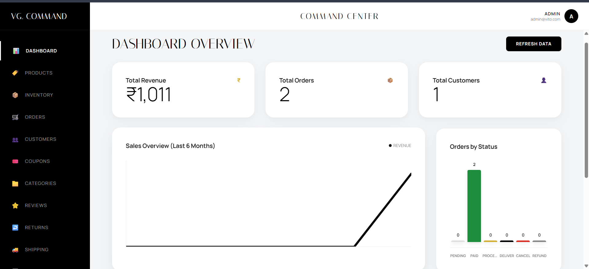
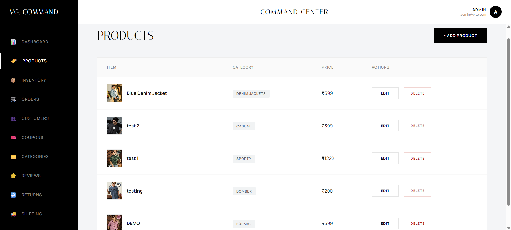
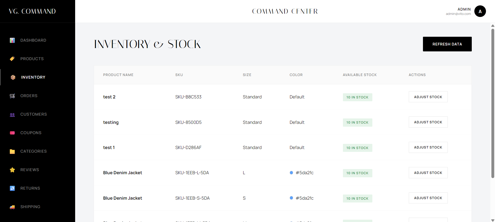
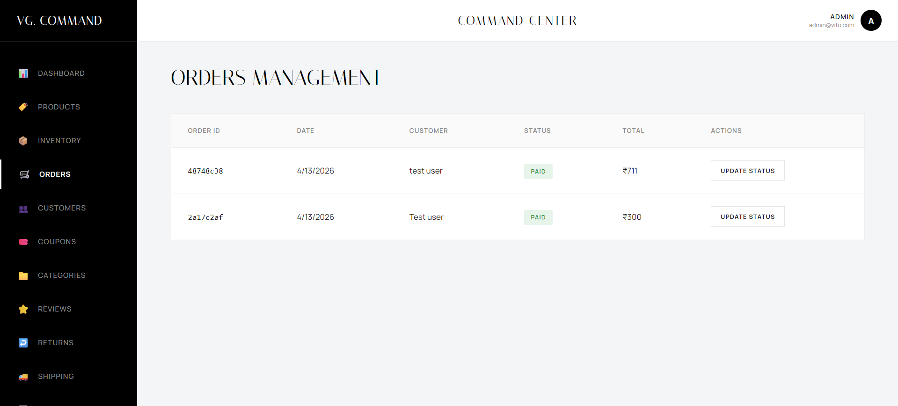
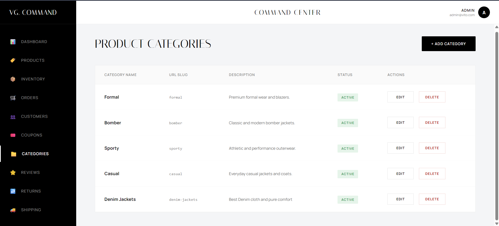
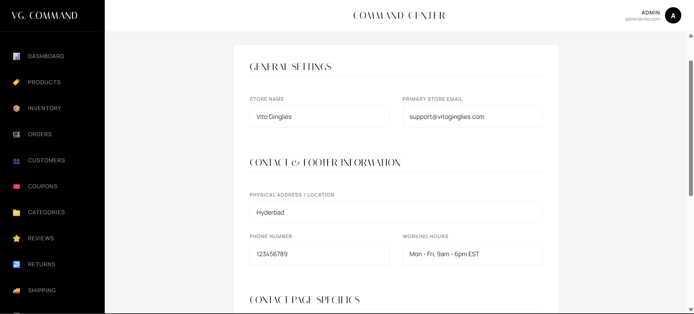

# Vito Ginglies | Premium E-Commerce & Command Center

> **Engineered for inertia. Crafted for the modern silhouette.** Vito Ginglies is a fully functional, high-end e-commerce storefront paired with a custom-built, enterprise-grade Admin Command Center. Designed to deliver a seamless shopping experience for customers while providing comprehensive, real-time store management tools for administrators.

🌐 **Live Storefront:** [https://vitogingliesstore.netlify.app/](https://vitogingliesstore.netlify.app/)

---

## ✨ Storefront Features

The customer-facing application is built with a focus on luxury aesthetics, smooth interactions, and conversion optimization.

* **Premium UI/UX:** A sleek, responsive design featuring modern typography and fluid animations.
* **Dynamic Product Details (PDP):** Interactive touch-swipe image carousels and real-time variant selection.
* **Cart & Wishlist System:** Frictionless cart management and local wishlist storage.
* **Secure Checkout Flow:** Integrated promo code validation, dynamic shipping zone calculation, and instant database synchronization.
* **Customer Accounts:** Personalized dashboards for users to track order status, active return requests, and manage addresses.

---

## 🛠️ Admin Command Center

A secure, real-time dashboard built to manage the entire lifecycle of the e-commerce business without touching the database directly.

* **Live Analytics Dashboard:** Real-time revenue tracking, order status bar graphs, and lifetime sales metrics (strictly filtering out refunded/cancelled orders).
* **Product & Inventory Management:** Full CRUD operations for products, stock levels, and swipe-enabled image galleries.
* **Order & Return Processing:** Intuitive slide-up modal workflows to approve/reject returns, which automatically sync with total revenue math.
* **Smart Customer Directory:** Automatically groups users by email, calculates Lifetime Value (LTV), and highlights VIP customers.
* **Dynamic Configurations:** Live editors for Categories, Shipping Zones, Promo Coupons, and Store Settings (including dynamic FormSubmit contact routing).

---

## 📸 Admin Panel Showcase

Here is a look inside the custom Admin Command Center:

### 1. Real-Time Dashboard

*Live revenue tracking, recent orders, and graphical performance metrics.*

### 2. Products Page

*Creating and managing product listings with dynamic variants and swipe-enabled image galleries.*

### 3. Inventory & Stock

*Real-time stock monitoring and low-inventory alerts to keep the storefront updated.*

### 4. Order Management

*Detailed order breakdown, fulfillment tracking, and intuitive return/refund approval workflows.*

### 5. Product Categories

*Dynamic control over storefront collections and category routing.*

### 6. Store Settings

*Global configuration for store details, contact page routing, and flat-rate shipping zones.*

---

## 💻 Tech Stack

* **Frontend:** React, TypeScript, Vite
* **Backend / Database:** Supabase (PostgreSQL, Auth, Row Level Security)
* **Styling:** Custom CSS (Glassmorphism, Responsive Grid Architecture)
* **Hosting:** Netlify

---

## 🚀 Quick Start & Installation

To run this project locally, you will need Node.js installed and a free [Supabase](https://supabase.com/) account.

### 1. Clone & Install
Install the required dependencies:
```bash
npm install
```

### 2. Database Setup (Supabase)
This project includes a master SQL file to instantly generate the exact database architecture needed for the Command Center to function perfectly.
1. Create a new project in your Supabase dashboard.
2. Navigate to the **SQL Editor** tab.
3. Open the `supabase_schema.sql` file located in the root of this repository.
4. Copy all the contents, paste them into the Supabase SQL Editor, and click **Run**. 

### 3. Environment Variables (API Keys)
You need to link your local code to your new Supabase backend securely.
1. Create a file named `.env` in the root directory of the project.
2. Add your unique Supabase keys (found in your Supabase Dashboard under Settings > API):
```env
VITE_SUPABASE_URL=your_supabase_project_url_here
VITE_SUPABASE_ANON_KEY=your_supabase_anon_key_here

(Note: Never commit your .env file to version control. It is already included in the .gitignore.)

4. Launch the Application
Start the local development server:

```bash
npm run dev
```
The storefront will be available at http://localhost:5173. To access the Admin Command Center, navigate to http://localhost:5173/admin.

**Designed and Developed by** [Donavalli Jayanth](https://jayanth.site)
